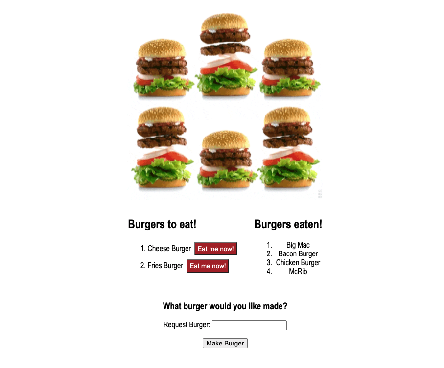

# [Bite a Burger](https://biteaburger.herokuapp.com/)

    
    
    
    

    
    

## Workflow

After a confusing attempt to do too many things, I got together with a few guys from my study group. One of them had completed this homework assignment and was helping us understand the logic he used. He said he had started the same way we had, using the MVC activity as a blueprint. However, he said a lot of it was confusing to him and he went back to some of our other activitites for reference. As he explained his logic and showed us his code, it made a lot more sense to follow his logic/example and rework my files. The bit that really made it click for me was passing parameters inside our functions. That reminded us all of a previous homework assignment where we were testing code by passing paramaters inside our functions. Having that "aha!" moment was really great and having it with members of my study group made it even more special.

Unfortunately, I didn't quite get the concept that my study group member explained to us. So, I went over the code with my tutor and we came to the conclusion that I would be best served to redo the parts of the project that were not clicking for me in my head. Which is fine. I know that this is important and I wanted to get it down.

After a lot of trial and error, I realized my MySQL statements were missing a spaces in a few of my queries. With most of those working, I decided to not try to delete the burgers and just do some styling to finish the project.

With the styling done, I moved on to trying to deploy to Heroku. This was a bit confusing for a few reasons. The instructions video given was for Sequelize, not MySQL. Also, the demonstration in the PDF wasn't for MySQL Workbench, which made it a bit difficult to follow. However, I was able to deploy my app to Heroku while utilizing JawsDB.

## Screenshot of application

## Application Demo

To watch a video of the application being fully demo'd please use this link: [Application Demo](https://drive.google.com/file/d/1qfb1RDr2j80Yaryc5hU6Ev3wE4MEP_NR/view).

## Technologies Used

  
  
  
  
  
  
  

## Resources

[Shields.io](https://shields.io/)

[Screencastify](https://www.screencastify.com/)

My Study Group

- [Ian](https://github.com/Ianaac27)
- [Thomas](https://github.com/Tskading)
- [Zac](https://github.com/themancalledzac)
